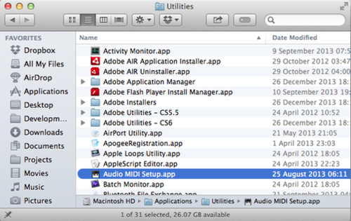
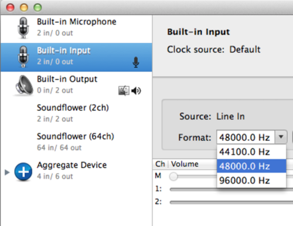

# Server won't boot

## Sample rates do not match
When trying to boot the server with `s.boot;` you may get the message

    input and output sample rates do not match. 44100 != 48000
    could not initialize audio.
    RESULT = 1
    ERROR: server failed to start

### Audio MIDI Setup
To solve this open the Application `Audio MIDI Setup` which is in `/Applications/Utilities`

### Matching Sample Rates

Now set the sample rate for each device with an icon next to it `48000.0 Hz`.

If it refuses and keeps switching back to `44100.0 Hz` then set them all to that, it's just important that they match.

## Still won't boot

Run 

    Server.killAll;
    s.boot;

## STILL won't boot

Quit and re-open SuperCollider